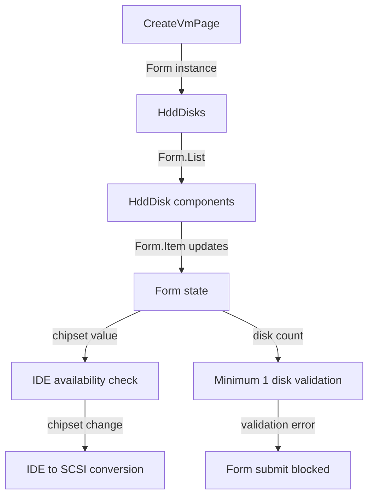
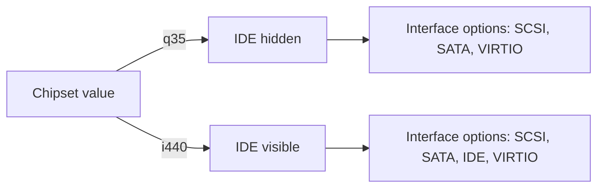
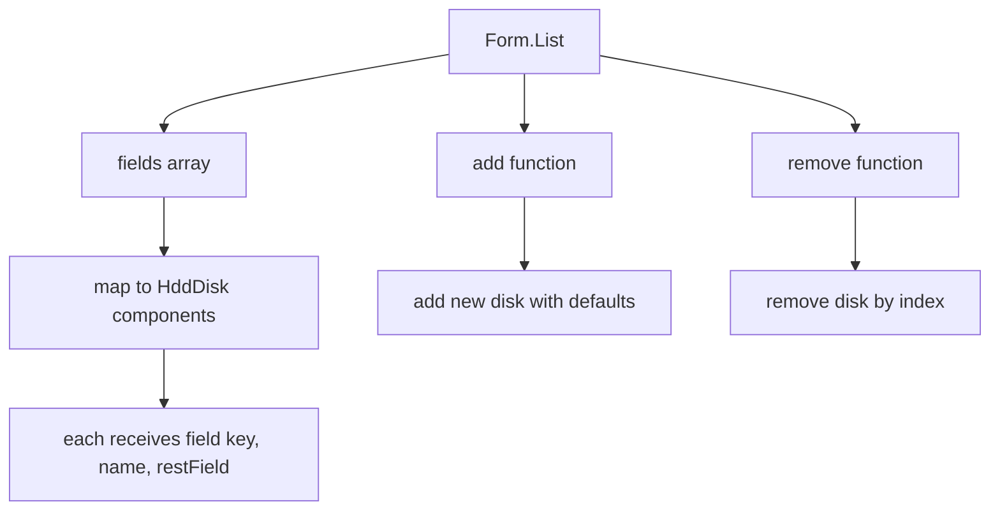

# HDD Disks Section Implementation Plan

## Overview
This plan details the implementation of the HDD Disks section for the VM creation form. The section will allow users to dynamically add, edit, and remove HDD disks with various attributes.

## 1. File Structure

### Files to Create
```
src/pages/vm/HddDisks/
├── index.tsx          # Main HddDisks component (section container)
└── HddDisk.tsx        # Individual disk component
```

### Files to Modify
```
src/pages/vm/types.ts  # Add HddDisk interface and extend CreateVmFormValues
src/pages/vm/create.tsx # Import and use HddDisks component
```

## 2. Component Hierarchy and Data Flow

### Component Hierarchy
```
CreateVmPage (create.tsx)
└── Form
    ├── MainInfo (existing)
    └── HddDisks (new)
        └── Form.List
            └── HddDisk (repeated for each disk)
                ├── Form.Item (name)
                ├── Form.Item (enabled)
                ├── Form.Item (size)
                └── Form.Item (diskInterface)
```

### Data Flow Diagram


### State Management
- **Form State**: Managed by Ant Design's Form instance
- **hddDisks**: Array of HddDisk objects stored in form values
- **chipset**: Watched from form state to control IDE interface availability
- **disk indices**: 1-indexed (disk-1, disk-2, disk-3), preserved on deletion

## 3. Type Definitions

### HddDisk Interface (types.ts)
```typescript
export interface HddDisk {
  name: string;           // Format: disk-{index}
  enabled: boolean;       // true/false
  size: number;           // Size in GB
  diskInterface: 'SCSI' | 'SATA' | 'IDE' | 'VIRTIO';
}
```

### Extended CreateVmFormValues (types.ts)
```typescript
export interface CreateVmFormValues {
  name: string;
  description: string;
  cpuCount: number;
  ramSize: number;
  chipset: 'q35' | 'i440';
  hddDisks: HddDisk[];    // New field
}
```

## 4. Validation Strategy

### Field-Level Validation

| Field         | Validation Rules                                                                 |
|---------------|----------------------------------------------------------------------------------|
| name          | Required, auto-generated as `disk-{index}`                                       |
| enabled       | Required, default `true`                                                         |
| size          | Required, type number, min 1, max 1024 (GB)                                     |
| diskInterface | Required, enum: SCSI, SATA, IDE, VIRTIO (IDE hidden when chipset='q35')        |

### Form-Level Validation
- **Minimum 1 disk**: Form cannot submit if `hddDisks.length === 0`
- **Immediate validation**: Triggered when last disk is deleted

### Validation Implementation Approach

#### Field-Level (in HddDisk.tsx)
```typescript
// Name field - auto-generated, no user input needed
<Form.Item name="name" initialValue={`disk-${index + 1}`} hidden />

// Enabled field - required with default
<Form.Item
  name="enabled"
  valuePropName="checked"
  initialValue={true}
  rules={[{ required: true, message: 'Required' }]}
>
  <Switch />
</Form.Item>

// Size field - required with range
<Form.Item
  name="size"
  initialValue={128}
  rules={[
    { required: true, message: 'Required' },
    { type: 'number', min: 1, max: 1024, message: 'Size must be 1-1024 GB' }
  ]}
>
  <InputNumber min={1} max={1024} suffix="ГБ" style={{width: '100%'}} />
</Form.Item>

// Interface field - required with chipset dependency
<Form.Item
  name="diskInterface"
  initialValue="SCSI"
  rules={[{ required: true, message: 'Required' }]}
>
  <Select options={interfaceOptions} />
</Form.Item>
```

#### Form-Level (in HddDisks/index.tsx)
```typescript
// Using Form.List's validator
<Form.List
  name="hddDisks"
  rules={[
    {
      validator: async (_, disks) => {
        if (!disks || disks.length === 0) {
          return Promise.reject(new Error('Minimum 1 HDD disk required'));
        }
        return Promise.resolve();
      }
    }
  ]}
>
  {/* ... */}
</Form.List>
```

## 5. Chipset Dependency Handling

### IDE Interface Availability Logic



### Implementation Strategy

#### Option 1: Dynamic Options (Recommended)
- Watch chipset value using `Form.useWatch`
- Dynamically filter interface options based on chipset
- When chipset changes to 'q35', convert existing IDE disks to SCSI

#### Option 2: Form-Level Validation
- Allow IDE selection but validate at form submit
- Show error if IDE selected with q35 chipset

**Selected Approach**: Option 1 (Dynamic Options)

### Implementation Details

```typescript
// In HddDisks/index.tsx
const chipset = Form.useWatch('chipset', form);

const getInterfaceOptions = (): Array<{label: string, value: string}> => {
  const baseOptions = [
    {label: 'SCSI', value: 'SCSI'},
    {label: 'SATA', value: 'SATA'},
    {label: 'VIRTIO', value: 'VIRTIO'},
  ];

  if (chipset !== 'q35') {
    baseOptions.push({label: 'IDE', value: 'IDE'});
  }

  return baseOptions;
};

// Handle chipset change - convert IDE to SCSI
useEffect(() => {
  if (chipset === 'q35') {
    const disks = form.getFieldValue('hddDisks') || [];
    const updatedDisks = disks.map((disk: HddDisk) =>
      disk.diskInterface === 'IDE' ? {...disk, diskInterface: 'SCSI'} : disk
    );
    form.setFieldValue('hddDisks', updatedDisks);
  }
}, [chipset, form]);
```

## 6. Dynamic List Implementation with Form.List

### Form.List Structure



### Key Features

1. **Add Disk**: Creates new disk with default values
   - name: `disk-{nextIndex}` (1-indexed)
   - enabled: `true`
   - size: `128`
   - diskInterface: `SCSI`

2. **Remove Disk**: Deletes disk at specified index
   - Preserves original indices (no renumbering)
   - Triggers minimum 1 disk validation

3. **Index Management**:
   - Use `fields.length + 1` for new disk names
   - Display `index + 1` for disk numbers (#1, #2, #3)
   - Never renumber existing disks

### Implementation Code Structure

```typescript
// HddDisks/index.tsx
const HddDisks: React.FC = () => {
  const form = Form.useFormInstance();
  const chipset = Form.useWatch('chipset', form);

  return (
    <Card
      title={
        <Flex vertical gap={4} style={{paddingBottom: 10}}>
          <Title level={4} style={{margin: 0, paddingTop: 16}}>
            Диски HDD
          </Title>
          <Text type="secondary">
            Добавьте минимум один диск для виртуальной машины
          </Text>
        </Flex>
      }
      extra={
        <Button
          type="primary"
          icon={<PlusOutlined />}
          onClick={() => {
            // Add new disk logic
          }}
        >
          Добавить диск
        </Button>
      }
    >
      <Form.List name="hddDisks">
        {(fields, { add, remove }) => (
          <>
            {fields.map((field, index) => (
              <HddDisk
                key={field.key}
                field={field}
                index={index}
                remove={remove}
                chipset={chipset}
              />
            ))}
          </>
        )}
      </Form.List>
    </Card>
  );
};
```

## 7. Step-by-Step Implementation Order

### Phase 1: Type Definitions
1. **Add HddDisk interface to types.ts**
   - Define interface with all required fields
   - Export for use in components

2. **Extend CreateVmFormValues in types.ts**
   - Add `hddDisks: HddDisk[]` field
   - Ensure TypeScript compatibility

### Phase 2: HddDisk Component
3. **Create src/pages/vm/HddDisks/HddDisk.tsx**
   - Implement individual disk component
   - Add all form fields (name, enabled, size, interface)
   - Implement field-level validation
   - Add delete button with confirmation
   - Display disk number (#N)
   - Handle interface options based on chipset prop

### Phase 3: HddDisks Section
4. **Create src/pages/vm/HddDisks/index.tsx**
   - Implement main section component
   - Add Card with title and "Add" button
   - Implement Form.List with minimum 1 disk validation
   - Watch chipset value for IDE availability
   - Implement chipset change handler (IDE → SCSI conversion)
   - Pass props to HddDisk components

### Phase 4: Integration
5. **Update src/pages/vm/create.tsx**
   - Import HddDisks component
   - Add HddDisks to form (after MainInfo)
   - Add `hddDisks: []` to initialValues

6. **Run TypeScript check**
   - Execute `npm run ts`
   - Fix any TypeScript errors

7. **Run linter**
   - Execute `npm run lint`
   - Fix any linting issues

### Phase 5: Testing
8. **Manual testing checklist**
   - [ ] Add first disk - should appear with defaults
   - [ ] Add multiple disks - should have correct indices
   - [ ] Delete disk - should preserve other indices
   - [ ] Delete last disk - should show validation error
   - [ ] Change chipset to q35 - IDE should disappear from options
   - [ ] Change chipset to q35 with IDE disk - should auto-convert to SCSI
   - [ ] Change chipset to i440 - IDE should appear in options
   - [ ] Try to submit with 0 disks - should fail validation
   - [ ] Try to submit with 1+ disks - should succeed
   - [ ] Verify all field validations work correctly

## 8. Component Props Interface

### HddDisk Props
```typescript
interface HddDiskProps {
  field: { name: NamePath; key: React.Key; ... };
  index: number;              // 0-based index for display (#N)
  remove: (index: number) => void;
  chipset: 'q35' | 'i440';   // Current chipset value
}
```

### HddDisks Props
```typescript
interface HddDisksProps {
  // No props needed - uses Form.useFormInstance()
}
```

## 9. Edge Cases and Considerations

### Edge Cases
1. **Deleting all disks**: Show validation error immediately
2. **Chipset change with IDE disks**: Auto-convert to SCSI
3. **Adding disk after deletions**: Use next available index (not renumbered)
4. **Form reset**: Should clear hddDisks array
5. **Form submit with invalid data**: Should show all validation errors

### Performance Considerations
- Use `React.memo` for HddDisk if performance issues arise
- Debounce chipset change handler if needed
- Consider virtual scrolling for large numbers of disks (unlikely in this use case)

### Accessibility
- Ensure delete buttons have proper aria-labels
- Use semantic HTML for form structure
- Provide clear error messages for validation failures

## 10. Code Style and Patterns

### Following Existing Patterns
- Use named exports for components
- Use Card with Flex vertical title layout
- Use Row/Col grid system with gutter={16}
- Use Form.Item with name, label, and rules
- Use Ant Design components (Input, InputNumber, Select, Switch)
- Follow TypeScript strict mode

### Naming Conventions
- Component files: PascalCase (HddDisk.tsx)
- Component names: PascalCase (HddDisk)
- Interface names: PascalCase (HddDisk)
- Form field names: camelCase (hddDisks)
- Variable names: camelCase

## 11. Dependencies

### Ant Design Components Used
- Card (section container)
- Form.List (dynamic list management)
- Form.Item (form field wrapper)
- Input (text input - not used for name, auto-generated)
- InputNumber (size field)
- Select (interface field)
- Switch (enabled field)
- Button (add/delete actions)
- Typography (Title, Text)
- Flex (layout)
- Row, Col (grid layout)
- Space (button grouping)

### React Hooks Used
- Form.useFormInstance() (access form context)
- Form.useWatch() (watch chipset changes)
- useEffect() (handle chipset side effects)

## 12. Summary

This implementation plan provides a comprehensive guide for building the HDD Disks section with:

- ✅ Dynamic list management using Form.List
- ✅ 1-indexed naming (disk-1, disk-2, disk-3)
- ✅ Automatic IDE → SCSI conversion on chipset change
- ✅ Immediate minimum 1 disk validation
- ✅ Preserved indices on deletion
- ✅ Field-level and form-level validation
- ✅ Chipset-dependent interface options
- ✅ Clear component hierarchy and data flow
- ✅ Step-by-step implementation order

The plan follows existing code patterns and integrates seamlessly with the current VM creation form structure.
